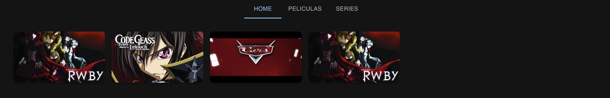
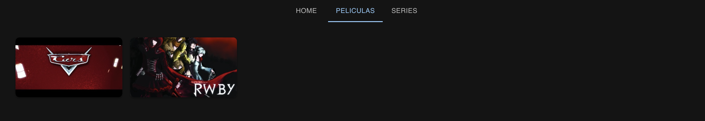
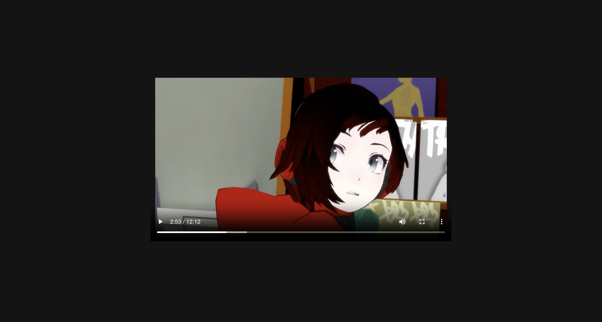
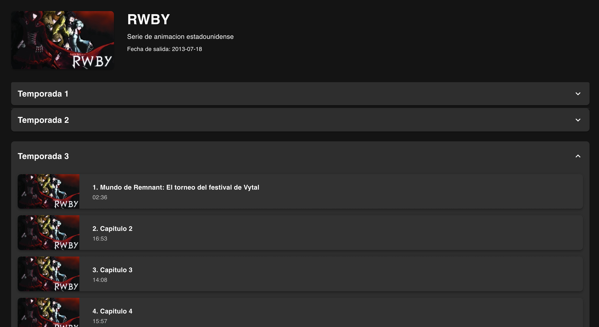

# Virma
Este es el repositorio que contiene el frontend de Virma, una aplicacion de streaming. Esta página web está hecha con `React + TypeScript + Vite + MUI`.

Puedes ver el repositorio de la API aquí: [API Backend](https://github.com/NicolasRodriguezSteuerberg/VirmaBackend.git)

Para ejecutar la página web se precisa crear un fichero `.env` con el siguiente formato:
```txt
VITE_API_URL=ip_puerto_backend
```

<details>
  <summary><b>Imagenes de la aplicacion</b></summary>

  
  
  
  
  

</details>